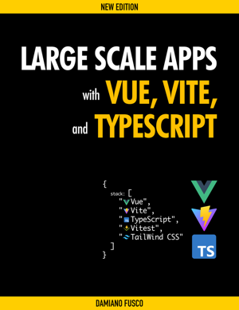

# Large Scale Apps with Vue, Vite and TypeScript (new edition)

### Companion code for the book:

 

[Large Scale Apps with Vue, Vite, and TypeScript](
https://leanpub.com/vue-vite-typescript "Large Scale Apps with Svelte and TypeScript")

### Note

The folder `my-vue-project` contains the main project built throughout the to the new edition of the book.

The `steps-by-chapter` folder contains individual projects as per steps in each chapters to get you unstuck should you encounter any issues.

The folder `my-component-library` contains the component project library as per Chapter 17 of the book.

The folder `my-js-helpers` contains the helpers project library as per Chapter 18 of the book.
